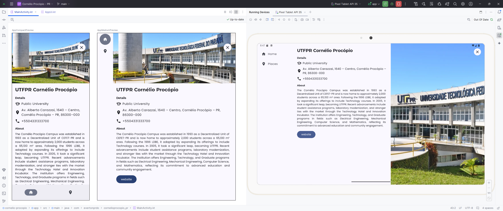

# Create a My City App

This app should:

- Contain multiple screens; for example, each screen can display a different category of recommendations.
- Use the Jetpack Navigation component to enable users to navigate through your app.
- Maintain a clear distinction between the UI layer and the data layer.
- Use a ViewModel and make updates to the UI from the view model using the unidirectional data flow (UDF) pattern.
- Use adaptive layouts that account for all different screen sizes.
- Follow Material Design guidelines for adaptive design and navigation.

Access [Project: Create a My City app](https://developer.android.com/codelabs/basic-android-kotlin-compose-my-city) codelab to see the full description of the application requirements

## App Home Screen

## App Places Screen

## App Description Screen

