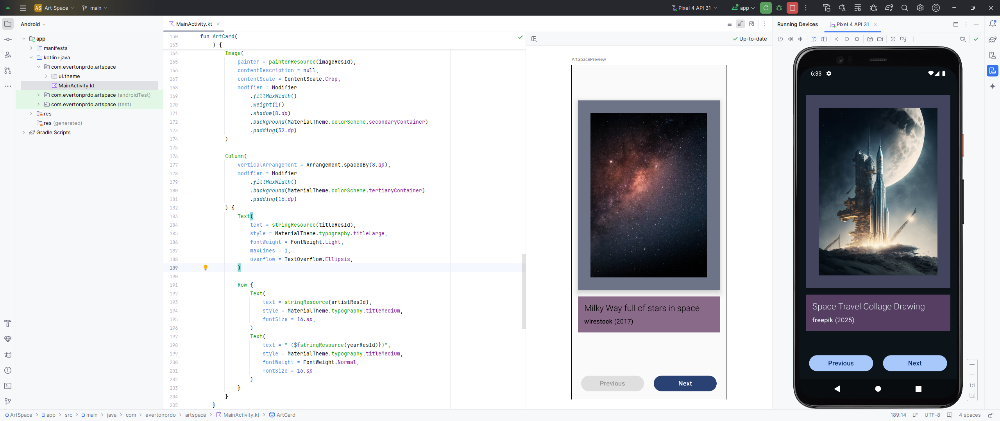
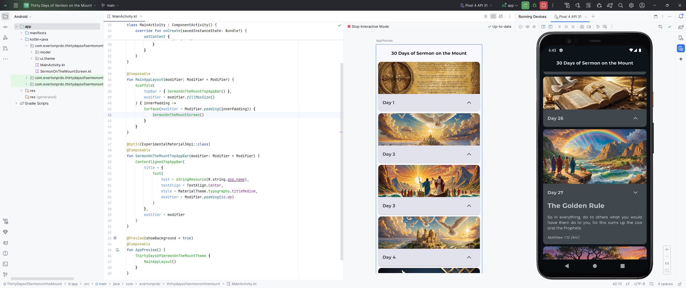
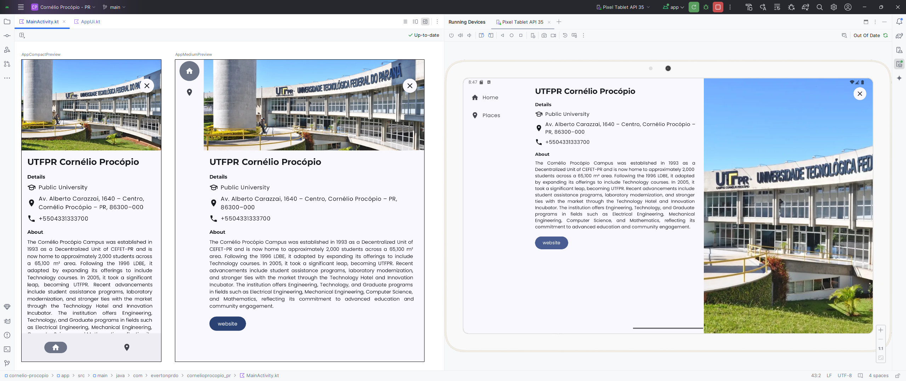
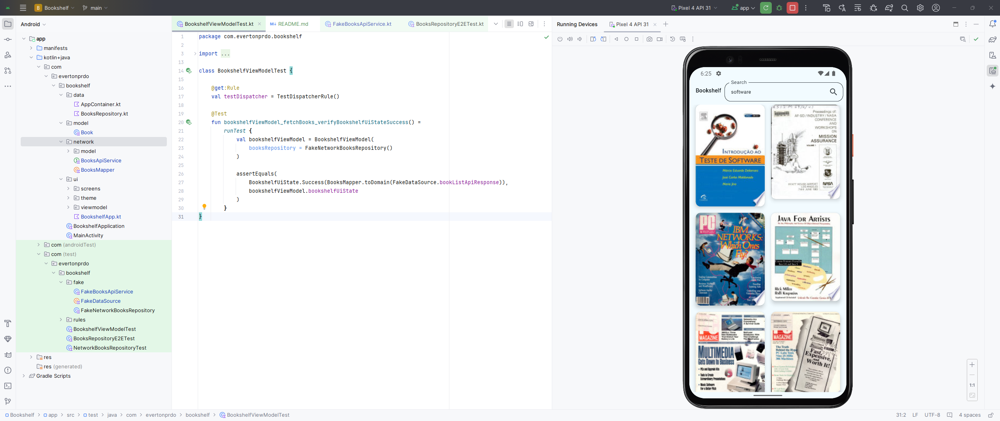
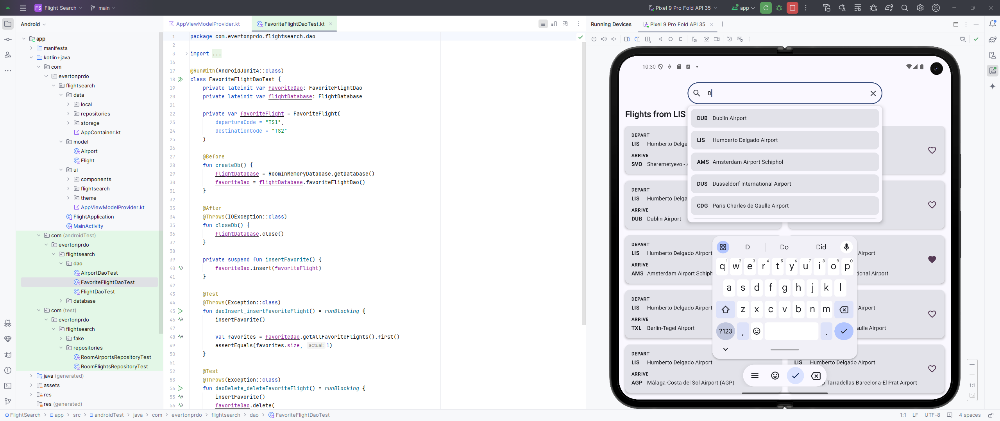

# Android basics projects

This repository contains the projects from the "Android Basics with Compose" course. The projects consist of instructions and some tips for developing an app using the concepts presented during the classes and also challenging the development through new resources needed to complete the challenge, thus culminating in deep and lasting learning.

The repository with all the apps developed during the course can be found here: https://github.com/evertonprdo/android-basics-with-compose

## Unit 1: Your first Android app

Learn programming basics and create your first Android app.

[Business Card App](01-business-card/)

## Unit 2: Building app UI

Continue learning the fundamentals of Kotlin, and start building more interactive apps.

[Art Space App](02-art-space/)

## Unit 3: Display lists and use Material Design

Build apps that display a list of data and learn how to make your apps more beautiful with Material Design.

[30 Days App](03-thirty-days/)

## Unit 4: Navigation and app architecture

Learn the best practices of app architecture to build more complex apps. Enhance your users' ability to navigate across, into and back out from the various screens within your app for a consistent and predictable user experience.

[My City App](04-my-city/)

## Unit 5: Connect to the internet

Use Kotlin coroutines to perform multiple tasks at once, and learn about HTTP and REST to get data from the internet using Retrofit. Then use the Coil library to display images in your app.

[Bookshelf App](05-bookshelf/)

## Unit 6: Data persistence

Learn how to store data locally on the device and keep your apps working through any network disruptions for a smooth and consistent user experience.

[Flight Search App](06-flight-search/)

